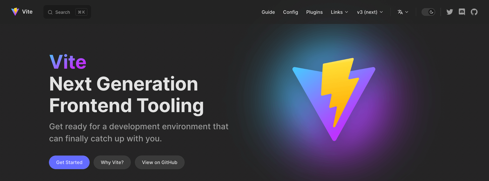
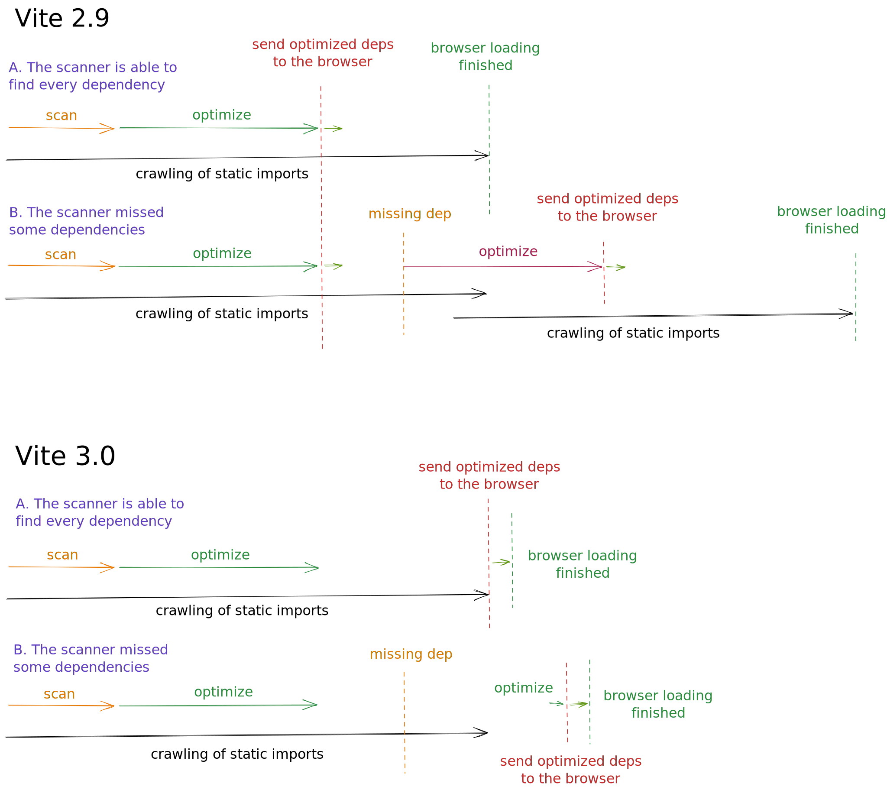
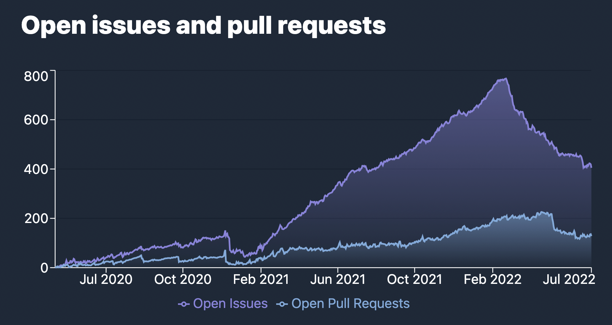
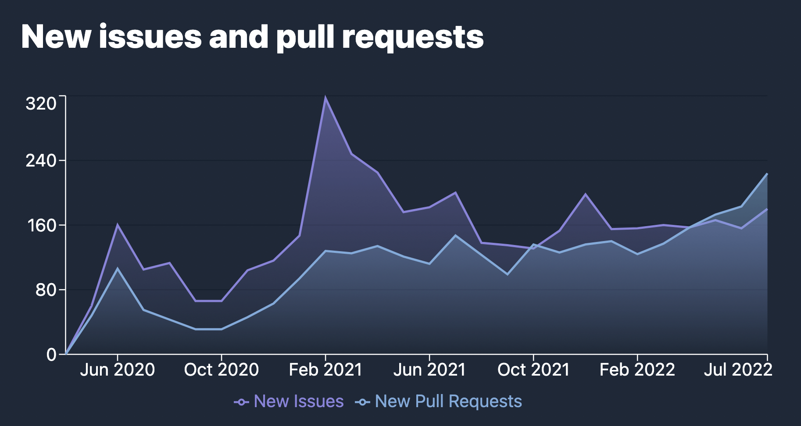

# Вышел Vite 3.0!

_23 июля 2022_ — см. также [анонс Vite 4.0](./announcing-vite4.md)

В феврале прошлого года [Evan You](https://twitter.com/youyuxi) выпустил Vite 2. С тех пор adoption не останавливается: больше 1 млн загрузок в неделю в npm. Быстро выросла экосистема. Vite подпитывает новую волну инноваций в веб-фреймворках. [Nuxt 3](https://v3.nuxtjs.org/) по умолчанию на Vite. [SvelteKit](https://kit.svelte.dev/), [Astro](https://astro.build/), [Hydrogen](https://hydrogen.shopify.dev/) и [SolidStart](https://docs.solidjs.com/quick-start) построены на Vite. [Laravel теперь по умолчанию использует Vite](https://laravel.com/docs/9.x/vite). [Vite Ruby](https://vite-ruby.netlify.app/) показывает, как Vite улучшает DX в Rails. [Vitest](https://vitest.dev) набирает обороты как Vite-native альтернатива Jest. За Vite стоят [Cypress](https://docs.cypress.io/guides/component-testing/writing-your-first-component-test) и [Playwright](https://playwright.dev/docs/test-components) в новых фичах component testing, у Storybook [Vite — официальный builder](https://github.com/storybookjs/builder-vite). И [список можно продолжать](https://patak.dev/vite/ecosystem.html). Мейнтейнеры многих из этих проектов участвуют в улучшении ядра Vite вместе с [командой](https://vite.dev/team) и другими контрибьюторами.


Сегодня, через 16 месяцев после v2, мы рады анонсировать Vite 3. Мы решили выпускать новый мажор Vite хотя бы раз в год, чтобы совпадать с [EOL Node.js](https://nodejs.org/en/about/releases/) и регулярно пересматривать API Vite с коротким путём миграции для экосистемы.

Быстрые ссылки:

- [Документация](/)
- [Руководство по миграции](https://v3.vite.dev/guide/migration.html)
- [Changelog](https://github.com/vitejs/vite/blob/main/packages/vite/CHANGELOG.md#300-2022-07-13)

Если Vite вам нов, прочитайте [Why Vite](https://vite.dev/guide/why.html). Затем [Getting Started](https://vite.dev/guide/) и [Features](https://vite.dev/guide/features). Как обычно, контрибьюции приветствуются на [GitHub](https://github.com/vitejs/vite). Более [600 контрибьюторов](https://github.com/vitejs/vite/graphs/contributors) уже помогли улучшить Vite. Обновления — в [Twitter](https://twitter.com/vite_js), обсуждения — в [Discord](https://chat.vite.dev).

## Новая документация

Заходите на [vite.dev](https://vite.dev) за документацией v3. Vite теперь на новой дефолтной теме [VitePress](https://vitepress.vuejs.org), с выразительным тёмным режимом и другими фичами.

[](https://vite.dev)

Несколько проектов экосистемы уже перешли на неё (см. [Vitest](https://vitest.dev), [vite-plugin-pwa](https://vite-plugin-pwa.netlify.app/) и сам [VitePress](https://vitepress.vuejs.org/)).

Документация Vite 2 остаётся на [v2.vite.dev](https://v2.vite.dev). Появился поддомен [main.vite.dev](https://main.vite.dev): каждый коммит в main Vite автоматически деплоится — удобно для beta и разработки ядра.

Появился официальный перевод на испанский, к уже существующим китайскому и японскому:

- [简体中文](https://cn.vite.dev/)
- [日本語](https://ja.vite.dev/)
- [Español](https://es.vite.dev/)

## Стартовые шаблоны Create Vite

Шаблоны [create-vite](/guide/#trying-vite-online) — удобный способ быстро попробовать Vite с любимым фреймворком. В Vite 3 у всех шаблонов новая тема в духе доков. Откройте онлайн и поиграйте с Vite 3:

<div class="stackblitz-links">
<a target="_blank" href="https://vite.new"></a>
<a target="_blank" href="https://vite.new/vue"></a>
<a target="_blank" href="https://vite.new/svelte"></a>
<a target="_blank" href="https://vite.new/react"></a>
<a target="_blank" href="https://vite.new/preact"></a>
<a target="_blank" href="https://vite.new/lit"></a>
</div>

<style>
.stackblitz-links {
  display: flex;
  width: 100%;
  justify-content: space-around;
  align-items: center;
}
@media screen and (max-width: 550px) {
  .stackblitz-links {
    display: grid;
    grid-template-columns: 1fr 1fr 1fr;
    width: 100%;
    gap: 2rem;
    padding-left: 3rem;
    padding-right: 3rem;
  }
}
.stackblitz-links > a {
  width: 70px;
  height: 70px;
  display: grid;
  align-items: center;
  justify-items: center;
}
.stackblitz-links > a:hover {
  filter: drop-shadow(0 0 0.5em #646cffaa);
}
</style>

Тема общая для всех шаблонов — так яснее, что это минимальные стартеры для входа в Vite. Для более полных решений с линтингом, тестами и т.д. есть официальные Vite-шаблоны вроде [create-vue](https://github.com/vuejs/create-vue) и [create-svelte](https://github.com/sveltejs/kit). Список шаблонов сообщества — в [Awesome Vite](https://github.com/vitejs/awesome-vite#templates).

## Улучшения в dev

### CLI Vite

<pre style="background-color: var(--vp-code-block-bg);padding:2em;border-radius:8px;max-width:100%;overflow-x:auto;">
  <span style="color:lightgreen"><b>VITE</b></span> <span style="color:lightgreen">v3.0.0</span>  <span style="color:gray">ready in <b>320</b> ms</span>

  <span style="color:lightgreen"><b>➜</b></span>  <span style="color:white"><b>Local</b>:</span>   <span style="color:cyan">http://127.0.0.1:5173/</span>
  <span style="color:green"><b>➜</b></span>  <span style="color:gray"><b>Network</b>: use --host to expose</span>
</pre>

Помимо внешнего вида CLI: dev server по умолчанию на порту 5173, preview — на 4173. Так Vite реже конфликтует с другими инструментами.

### Улучшенная стратегия WebSocket

В Vite 2 было больно настраивать сервер за прокси. В Vite 3 схема подключения по умолчанию чаще работает из коробки. Такие сценарии теперь проверяются в Vite Ecosystem CI через [`vite-setup-catalogue`](https://github.com/sapphi-red/vite-setup-catalogue).

### Улучшения cold start

Vite не делает полный reload при cold start, когда плагины подмешивают импорты при обходе начальных статических импортов ([#8869](https://github.com/vitejs/vite/issues/8869)).

<details>
  <summary><b>Подробнее</b></summary>

В Vite 2.9 и scanner, и optimizer работали в фоне. В лучшем случае, если scanner находил все зависимости, reload при cold start не нужен был. Если зависимость пропускали — нужны были новая фаза оптимизации и reload. В v2.9 часть reload’ов удалось избежать, проверяя совместимость новых чанков с уже загруженными в браузере; но при общей зависимости под-чанки могли меняться и reload был нужен. В Vite 3 оптимизированные deps не отдаются браузеру, пока не завершён обход статических импортов. Быстрая фаза оптимизации запускается при пропущенной зависимости (например, внедрённой плагином), и только потом отдаются собранные deps — полный reload для таких случаев больше не нужен.

</details>



### import.meta.glob

Поддержка `import.meta.glob` переписана. Новые возможности — в [руководстве по glob-импорту](/guide/features.html#glob-import):

[Несколько паттернов](/guide/features.html#multiple-patterns) можно передать массивом

```js
import.meta.glob(['./dir/*.js', './another/*.js'])
```

[Негативные паттерны](/guide/features.html#negative-patterns) (префикс `!`) для исключения файлов

```js
import.meta.glob(['./dir/*.js', '!**/bar.js'])
```

[Именованные импорты](/guide/features.html#named-imports) для лучшего tree-shaking

```js
import.meta.glob('./dir/*.js', { import: 'setup' })
```

[Произвольные query](/guide/features.html#custom-queries) для метаданных

```js
import.meta.glob('./dir/*.js', { query: { custom: 'data' } })
```

[Eager imports](/guide/features.html#glob-import) задаются флагом

```js
import.meta.glob('./dir/*.js', { eager: true })
```

### Импорт WASM в духе будущих стандартов

API импорта WebAssembly пересмотрен, чтобы не конфликтовать с будущими стандартами и быть гибче:

```js
import init from './example.wasm?init'

init().then((instance) => {
  instance.exports.test()
})
```

Подробнее — в [руководстве по WebAssembly](/guide/features.html#webassembly)

## Улучшения сборки

### ESM SSR build по умолчанию

Большинство SSR-фреймворков в экосистеме уже использовали ESM-сборки. В Vite 3 формат SSR по умолчанию — ESM. Это упрощает прежние [эвристики externalization для SSR](https://vite.dev/guide/ssr.html#ssr-externals): зависимости по умолчанию external’ятся.

### Корректная поддержка относительного base

Vite 3 корректно поддерживает относительный base (`base: ''`), чтобы собранные ассеты можно было выкладывать на разные базовые пути без пересборки. Полезно, когда base неизвестен на этапе сборки, например при деплое в content-addressable сети вроде [IPFS](https://ipfs.io/).

## Экспериментальные возможности

### Точный контроль путей к собранным ассетам (experimental)

Бывают сценарии, где этого мало: например, хешированные ассеты на другой CDN, чем публичные файлы — нужен более тонкий контроль путей при сборке. В Vite 3 есть experimental API для изменения путей собранных файлов. См. [Advanced Base Options](/guide/build.html#advanced-base-options).

### Оптимизация deps через esbuild на этапе сборки (experimental)

Главное отличие dev и build — обработка зависимостей. При сборке используется [`@rollup/plugin-commonjs`](https://github.com/rollup/plugins/tree/master/packages/commonjs) для импорта только-CJS пакетов (например React). В dev esbuild pre-bundle’ит и оптимизирует зависимости, к user-коду применяется inline interop для CJS. В разработке Vite 3 добавлена возможность [оптимизировать зависимости через esbuild и при сборке](https://v3.vite.dev/guide/migration.html#using-esbuild-deps-optimization-at-build-time). Тогда [`@rollup/plugin-commonjs`](https://github.com/rollup/plugins/tree/master/packages/commonjs) можно не использовать — dev и build ведут себя одинаково.

Rollup v3 выйдет в ближайшие месяцы, за ним последует ещё один мажор Vite; мы сделали этот режим опциональным, чтобы сузить scope v3 и дать экосистеме время обкатать новый CJS interop при сборке. Фреймворки могут переключаться на esbuild deps optimization при сборке в своём темпе до Vite 4.

### HMR Partial Accept (experimental)

Опциональная поддержка [HMR Partial Accept](https://github.com/vitejs/vite/pull/7324) — более тонкий HMR для компонентов, экспортирующих несколько биндингов из одного модуля. Подробнее — в [обсуждении предложения](https://github.com/vitejs/vite/discussions/7309).

## Уменьшение размера пакета

Vite следит за размером publish/install; быстрая установка нового приложения — это фича. Зависимости по возможности бандлятся и заменяются лёгкими альтернативами. В Vite 3 publish size примерно на 30% меньше, чем в v2.

|             | Publish Size | Install Size |
| ----------- | :----------: | :----------: |
| Vite 2.9.14 |    4.38MB    |    19.1MB    |
| Vite 3.0.0  |    3.05MB    |    17.8MB    |
| Reduction   |     -30%     |     -7%      |

Частично за счёт того, что часть зависимостей стала optional. [Terser](https://github.com/terser/terser) больше не ставится по умолчанию — для минификации JS и CSS уже используется esbuild. Если нужен `build.minify: 'terser'`, установите пакет (`npm add -D terser`). [node-forge](https://github.com/digitalbazaar/forge) вынесен из монорепо; автогенерация HTTPS-сертификатов — в плагине [`@vitejs/plugin-basic-ssl`](https://v3.vite.dev/guide/migration.html#automatic-https-certificate-generation): самоподписанные недоверенные сертификаты не оправдывали вес в core.

## Исправление багов

Марафон триажа возглавили [@bluwyoo](https://twitter.com/bluwyoo) и [@sapphi_red](https://twitter.com/sapphi_red), недавно вошедшие в команду Vite. За три месяца открытых issues сократились с 770 до 400 при рекордном потоке новых PR. [@haoqunjiang](https://twitter.com/haoqunjiang) собрал [обзор issues Vite](https://github.com/vitejs/vite/discussions/8232).

[](https://www.repotrends.com/vitejs/vite)

[](https://www.repotrends.com/vitejs/vite)

## Заметки по совместимости

- Vite больше не поддерживает Node.js 12 / 13 / 15 (EOL). Нужны Node.js 14.18+ / 16+.
- Vite публикуется как ESM, с CJS-прокси к ESM entry для совместимости.
- Modern browser baseline — браузеры с [нативными ES Modules](https://caniuse.com/es6-module), [нативным динамическим import ESM](https://caniuse.com/es6-module-dynamic-import) и [`import.meta`](https://caniuse.com/mdn-javascript_operators_import_meta).
- Расширения JS-файлов в SSR и library mode для entry и чанков — валидные (`js`, `mjs` или `cjs`) в зависимости от формата и `type` в package.

Подробнее — в [руководстве по миграции](https://v3.vite.dev/guide/migration.html).

## Обновления Vite Core

Параллельно с Vite 3 мы улучшили опыт контрибьюции в [Vite Core](https://github.com/vitejs/vite).

- Unit и E2E тесты переведены на [Vitest](https://vitest.dev) — быстрее и стабильнее DX, плюс dogfooding для экосистемы.
- Сборка VitePress входит в CI.
- Vite на [pnpm 7](https://pnpm.io/), как и остальная экосистема.
- Playgrounds перенесены в [`/playgrounds`](https://github.com/vitejs/vite/tree/main/playground).
- Пакеты и playgrounds с `"type": "module"`.
- Плагины бандлятся через [unbuild](https://github.com/unjs/unbuild); [plugin-vue-jsx](https://github.com/vitejs/vite-plugin-vue/tree/main/packages/plugin-vue-jsx) и [plugin-legacy](https://github.com/vitejs/vite/tree/main/packages/plugin-legacy) переведены на TypeScript.

## Экосистема готова к v3

Мы работали с проектами экосистемы, чтобы фреймворки на Vite были готовы к Vite 3. [vite-ecosystem-ci](https://github.com/vitejs/vite-ecosystem-ci) гоняет CI ключевых проектов против main Vite и ловит регрессии до релиза. Сегодняшний релиз должен быть совместим с большинством пользователей Vite.

## Благодарности

Vite 3 — результат работы [команды Vite](/team) вместе с мейнтейнерами экосистемы и контрибьюторами ядра.

Спасибо всем, кто делал фичи, фиксы, давал фидбек и участвовал в Vite 3:

- Участникам команды [@youyuxi](https://twitter.com/youyuxi), [@patak_dev](https://twitter.com/patak_dev), [@antfu7](https://twitter.com/antfu7), [@bluwyoo](https://twitter.com/bluwyoo), [@sapphi_red](https://twitter.com/sapphi_red), [@haoqunjiang](https://twitter.com/haoqunjiang), [@poyoho](https://github.com/poyoho), [@Shini_92](https://twitter.com/Shini_92), [@retropragma](https://twitter.com/retropragma).
- [@benmccann](https://github.com/benmccann), [@danielcroe](https://twitter.com/danielcroe), [@brillout](https://twitter.com/brillout), [@sheremet_va](https://twitter.com/sheremet_va), [@userquin](https://twitter.com/userquin), [@enzoinnocenzi](https://twitter.com/enzoinnocenzi), [@maximomussini](https://twitter.com/maximomussini), [@IanVanSchooten](https://twitter.com/IanVanSchooten), [команде Astro](https://astro.build/) и всем мейнтейнерам фреймворков и плагинов, кто формировал v3.
- [@dominikg](https://github.com/dominikg) за vite-ecosystem-ci.
- [@ZoltanKochan](https://twitter.com/ZoltanKochan) за [pnpm](https://pnpm.io/) и быструю поддержку.
- [@rixo](https://github.com/rixo) за HMR Partial Accept.
- [@KiaKing85](https://twitter.com/KiaKing85) за тему к релизу Vite 3 и [@\_brc_dd](https://twitter.com/_brc_dd) за внутренности VitePress.
- [@CodingWithCego](https://twitter.com/CodingWithCego) за испанский перевод; [@ShenQingchuan](https://twitter.com/ShenQingchuan), [@hiro-lapis](https://github.com/hiro-lapis) и другим за китайский и японский переводы.

Спасибо спонсорам команды Vite и компаниям, инвестирующим в развитие Vite: часть работы [@antfu7](https://twitter.com/antfu7) над Vite — в рамках [Nuxt Labs](https://nuxtlabs.com/); [StackBlitz](https://stackblitz.com/) нанял [@patak_dev](https://twitter.com/patak_dev) на full-time работу над Vite.

## Что дальше

Ближайшие месяцы — плавный переход для всех проектов на Vite; первые миноры сфокусируем на триаже новых issues.

Команда Rollup [готовит следующий мажор](https://twitter.com/lukastaegert/status/1544186847399743488). Когда экосистема плагинов обновится, выйдет новый мажор Vite — шанс стабилизировать experimental-фичи этого релиза.

Хотите помочь Vite — начните с триажа issues. Заходите в [Discord](https://chat.vite.dev), канал `#contributing`. Или `#docs`, `#help`, пишите плагины. Мы только начинаем; идей для улучшения DX ещё много.
