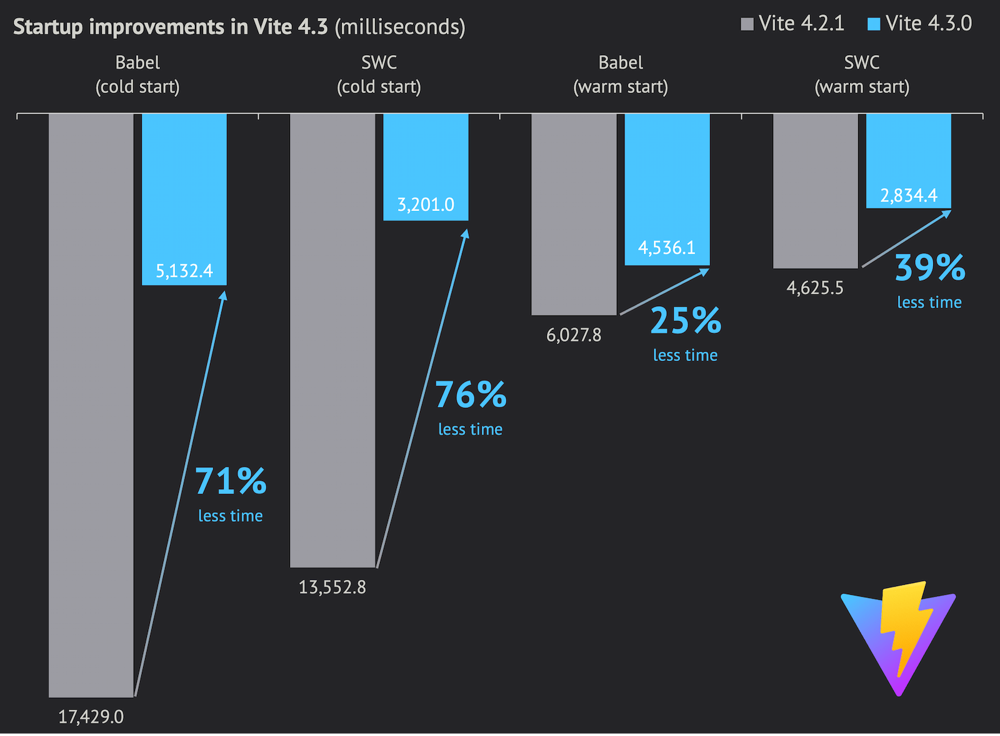
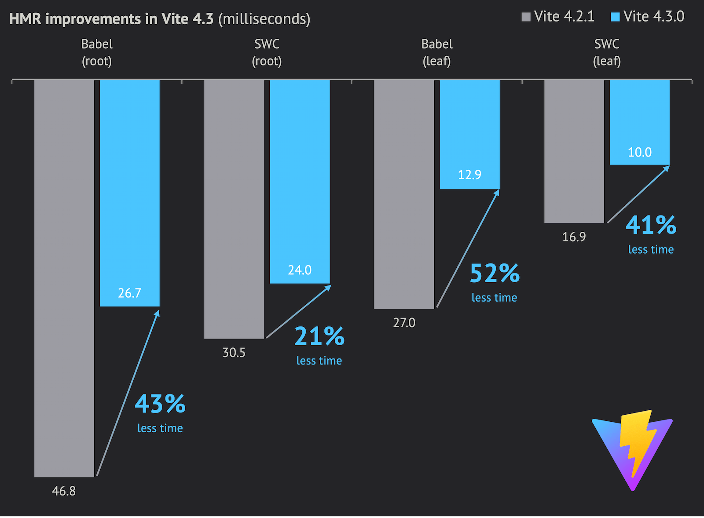

# Вышел Vite 4.3!

_20 апреля 2023_

Быстрые ссылки:

- Документация: [English](/), [简体中文](https://cn.vite.dev/), [日本語](https://ja.vite.dev/), [Español](https://es.vite.dev/), [Português](https://pt.vite.dev/)
- [Changelog Vite 4.3](https://github.com/vitejs/vite/blob/main/packages/vite/CHANGELOG.md#430-2023-04-20)

## Улучшения производительности

В этом миноре сфокусировались на производительности dev server. Упростили логику resolve, ускорили горячие пути и сделали умнее кэш при поиске `package.json`, TS-конфигов и resolved URL в целом.

Подробный разбор работы над perf — в посте одного из контрибьюторов Vite: [How we made Vite 4.3 faaaaster 🚀](https://sun0day.github.io/blog/vite/why-vite4_3-is-faster.html).

В итоге по сравнению с Vite 4.2 выигрыш по скорости по всем метрикам.

Замеры по [sapphi-red/performance-compare](https://github.com/sapphi-red/performance-compare): приложение с 1000 React-компонентами, cold/warm старт dev server и время HMR для корневого и листового компонента:

| **Vite (babel)**   |  Vite 4.2 | Vite 4.3 | Улучшение |
| :----------------- | --------: | -------: | --------: |
| **dev cold start** | 17249.0ms | 5132.4ms |      -70.2% |
| **dev warm start** |  6027.8ms | 4536.1ms |      -24.7% |
| **Root HMR**       |    46.8ms |   26.7ms |      -42.9% |
| **Leaf HMR**       |    27.0ms |   12.9ms |      -52.2% |

| **Vite (swc)**     |  Vite 4.2 | Vite 4.3 | Улучшение |
| :----------------- | --------: | -------: | --------: |
| **dev cold start** | 13552.5ms | 3201.0ms |      -76.4% |
| **dev warm start** |  4625.5ms | 2834.4ms |      -38.7% |
| **Root HMR**       |    30.5ms |   24.0ms |      -21.3% |
| **Leaf HMR**       |    16.9ms |   10.0ms |      -40.8% |

Подробнее о бенчмарке — [здесь](https://gist.github.com/sapphi-red/25be97327ee64a3c1dce793444afdf6e). Конфигурация замера:

- CPU: Ryzen 9 5900X, память: DDR4-3600 32GB, SSD: WD Blue SN550 NVME SSD
- Windows 10 Pro 21H2 19044.2846
- Node.js 18.16.0
- Версии Vite и React-плагинов
  - Vite 4.2 (babel): Vite 4.2.1 + plugin-react 3.1.0
  - Vite 4.3 (babel): Vite 4.3.0 + plugin-react 4.0.0-beta.1
  - Vite 4.2 (swc): Vite 4.2.1 + plugin-react-swc 3.2.0
  - Vite 4.3 (swc): Vite 4.3.0 + plugin-react-swc 3.3.0

Ранние пользователи на beta Vite 4.3 сообщали об ускорении cold start dev в 1.5–2 раза на реальных приложениях. Будем рады вашим цифрам.

## Профилирование

Продолжим работу над производительностью Vite. Готовится официальный [инструмент бенчмарков](https://github.com/vitejs/vite-benchmark) для метрик по каждому Pull Request.

У [vite-plugin-inspect](https://github.com/antfu/vite-plugin-inspect) появилось больше perf-фич, чтобы находить узкие места среди плагинов и middleware.

Команда `vite --profile` (после загрузки страницы нажать `p`) сохранит CPU profile старта dev server. Его можно открыть в [speedscope](https://www.speedscope.app/) и искать проблемы. Результаты можно обсудить в [Discussions](https://github.com/vitejs/vite/discussions) или в [Discord Vite](https://chat.vite.dev).

## Дальнейшие шаги

В этом году планируем один мажор Vite, синхронизированный с [EOL Node.js 16](https://endoflife.date/nodejs) в сентябре: в нём отпадёт поддержка Node.js 14 и 16. Хотите участвовать — загляните в [обсуждение Vite 5](https://github.com/vitejs/vite/discussions/12466) для раннего фидбека.
