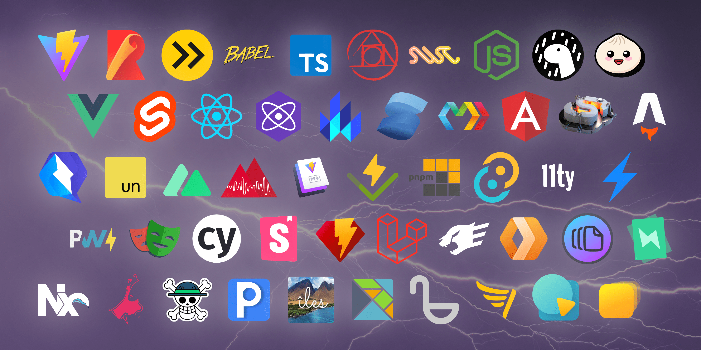

# Вышел Vite 4.0!

_9 декабря 2022_ — см. также [анонс Vite 5.0](./announcing-vite5.md)

Vite 3 [вышел](./announcing-vite3.md) пять месяцев назад. Загрузки в npm выросли с 1 млн до 2.5 млн в неделю. Экосистема созрела и растёт. В [опросе Jamstack Conf](https://twitter.com/vite_js/status/1589665610119585793) доля использования выросла с 14% до 32% при высоком satisfaction 9.7. Вышли стабильные [Astro 1.0](https://astro.build/), [Nuxt 3](https://v3.nuxtjs.org/) и другие Vite-фреймворки: [SvelteKit](https://kit.svelte.dev/), [Solid Start](https://www.solidjs.com/blog/introducing-solidstart), [Qwik City](https://qwik.builder.io/qwikcity/overview/). Storybook объявил first-class поддержку Vite как ключевую фичу [Storybook 7.0](https://storybook.js.org/blog/first-class-vite-support-in-storybook/). Deno теперь [поддерживает Vite](https://www.youtube.com/watch?v=Zjojo9wdvmY). [Vitest](https://vitest.dev) стремительно набирает долю и скоро составит половину npm-загрузок Vite. Nx инвестирует в экосистему и [официально поддерживает Vite](https://nx.dev/packages/vite).

[](https://viteconf.org/2022/replay)

Как иллюстрация роста Vite и связанных проектов, 11 октября прошла [ViteConf 2022](https://viteconf.org/2022/replay). Представители основных веб-фреймворков и инструментов рассказывали об инновациях и сотрудничестве. В тот же день команда Rollup выпустила [Rollup 3](https://rollupjs.org).

Сегодня [команда](https://vite.dev/team) Vite при поддержке партнёров из экосистемы анонсирует Vite 4: при сборке используется Rollup 3. Мы синхронизировались с экосистемой для плавной миграции. Vite переведён на [Rollup 3](https://github.com/vitejs/vite/issues/9870) — проще внутренняя работа с ассетами и много улучшений. См. [заметки к релизу Rollup 3](https://github.com/rollup/rollup/releases/tag/v3.0.0).


Быстрые ссылки:

- [Документация](/)
- [Руководство по миграции](https://v4.vite.dev/guide/migration.html)
- [Changelog](https://github.com/vitejs/vite/blob/main/packages/vite/CHANGELOG.md#400-2022-12-09)

Документация на других языках:

- [简体中文](https://cn.vite.dev/)
- [日本語](https://ja.vite.dev/)
- [Español](https://es.vite.dev/)

Если вы недавно начали с Vite, прочитайте [Why Vite](https://vite.dev/guide/why.html), затем [Getting Started](https://vite.dev/guide/) и [Features](https://vite.dev/guide/features). Контрибьюции — на [GitHub](https://github.com/vitejs/vite). Почти [700 контрибьюторов](https://github.com/vitejs/vite/graphs/contributors) внесли вклад в Vite. Обновления — в [Twitter](https://twitter.com/vite_js) и [Mastodon](https://webtoo.ls/@vite), общение — в [Discord](https://chat.vite.dev).

## Попробуйте Vite 4

Используйте `pnpm create vite` для скелета проекта с нужным фреймворком или откройте шаблон онлайн на [vite.new](https://vite.new).

Также можно `pnpm create vite-extra` — шаблоны для других фреймворков и рантаймов (Solid, Deno, SSR, library starters). Шаблоны `create vite-extra` доступны в `create vite` в опции `Others`.

Стартовые шаблоны Vite задуманы как площадка для экспериментов с разными фреймворками. Для реального проекта лучше брать рекомендованные фреймворком стартеры. Часть фреймворков уже редиректит из `create-vue` и `Nuxt 3` для Vue, `SvelteKit` для Svelte.

## Новый React-плагин со SWC в dev

[SWC](https://swc.rs/) — зрелая замена [Babel](https://babeljs.io/), особенно в React-проектах. Fast Refresh в SWC заметно быстрее Babel; для части проектов это лучший выбор. С Vite 4 для React доступны два плагина с разными компромиссами. Оба направления поддерживаем; улучшения для обоих планируем.

### @vitejs/plugin-react

[@vitejs/plugin-react](https://github.com/vitejs/vite-plugin-react) — esbuild + Babel: быстрый HMR, небольшой размер пакета и гибкость пайплайна Babel.

### @vitejs/plugin-react-swc (новый)

[@vitejs/plugin-react-swc](https://github.com/vitejs/vite-plugin-react-swc) — при сборке esbuild, в dev Babel заменён на SWC. Для крупных проектов без нестандартных расширений React cold start и HMR могут быть существенно быстрее.

## Совместимость с браузерами

Modern build по умолчанию таргетит `safari14` для более широкой поддержки ES2020: можно использовать [`BigInt`](https://developer.mozilla.org/en-US/docs/Web/JavaScript/Reference/Global_Objects/BigInt), [nullish coalescing](https://developer.mozilla.org/en-US/docs/Web/JavaScript/Reference/Operators/Nullish_coalescing) больше не транспилируется. Для старых браузеров подключайте [`@vitejs/plugin-legacy`](https://github.com/vitejs/vite/tree/main/packages/plugin-legacy) как раньше.

## Импорт CSS как строки

В Vite 3 default export из `.css` мог приводить к двойной загрузке CSS.

```ts
import cssString from './global.css'
```

Файл `.css` эмитился, а строка могла ещё использоваться в рантайме фреймворка — отсюда дублирование. С Vite 4 default export из `.css` [deprecated](https://github.com/vitejs/vite/issues/11094). Нужен суффикс `?inline` — так стили не эмитятся отдельно.

```ts
import stuff from './global.css?inline'
```

Подробнее — в [руководстве по миграции](https://v4.vite.dev/guide/migration.html).

## Переменные окружения

Vite использует `dotenv` 16 и `dotenv-expand` 9 (раньше `dotenv` 14 и `dotenv-expand` 5). Значения с `#` или `` ` `` нужно заключать в кавычки.

```diff
-VITE_APP=ab#cd`ef
+VITE_APP="ab#cd`ef"
```

Детали — в [changelog `dotenv`](https://github.com/motdotla/dotenv/blob/master/CHANGELOG.md) и [`dotenv-expand`](https://github.com/motdotla/dotenv-expand/blob/master/CHANGELOG.md).

## Прочие возможности

- Горячие клавиши CLI (в dev нажмите `h` за списком) ([#11228](https://github.com/vitejs/vite/pull/11228))
- Поддержка patch-package при pre-bundling зависимостей ([#10286](https://github.com/vitejs/vite/issues/10286))
- Более чистые логи сборки ([#10895](https://github.com/vitejs/vite/issues/10895)) и единицы `kB` как в DevTools браузера ([#10982](https://github.com/vitejs/vite/issues/10982))
- Улучшенные сообщения об ошибках в SSR ([#11156](https://github.com/vitejs/vite/issues/11156))

## Меньший размер пакета

Vite следит за размером для ускорения установки, в т.ч. в playground’ах для доков и репродьюсов. В этом мажоре снова уменьшили размер: install size Vite 4 на 23% меньше, чем у vite 3.2.5 (14.1 МБ против 18.3 МБ).

## Обновления Vite Core

[Vite Core](https://github.com/vitejs/vite) и [vite-ecosystem-ci](https://github.com/vitejs/vite-ecosystem-ci) развиваются для удобства мейнтейнеров и масштабирования под рост экосистемы.

### Плагины фреймворков вынесены из core

[`@vitejs/plugin-vue`](https://github.com/vitejs/vite-plugin-vue) и [`@vitejs/plugin-react`](https://github.com/vitejs/vite-plugin-react) были в монорепо Vite с ранних версий — удобный цикл фидбека при совместных релизах. С [vite-ecosystem-ci](https://github.com/vitejs/vite-ecosystem-ci) тот же фидбек возможен при разработке в отдельных репозиториях, поэтому с Vite 4 [плагины вынесены из core](https://github.com/vitejs/vite/pull/11158). Это укрепляет историю framework-agnostic Vite и позволит выделить команды под каждый плагин. Баги и фичи — в новых репозиториях: [`vitejs/vite-plugin-vue`](https://github.com/vitejs/vite-plugin-vue) и [`vitejs/vite-plugin-react`](https://github.com/vitejs/vite-plugin-react).

### Улучшения vite-ecosystem-ci

[vite-ecosystem-ci](https://github.com/vitejs/vite-ecosystem-ci) расширяет CI Vite отчётами по CI [основных downstream-проектов](https://github.com/vitejs/vite-ecosystem-ci/tree/main/tests). Запускаем три раза в неделю против main Vite, чтобы ловить регрессии до релиза. Vite 4 скоро будет совместим с большинством пользователей; проекты уже подготовили ветки с правками. На PR можно запускать ecosystem-ci по команде `/ecosystem-ci run` в комментарии и видеть [влияние изменений](https://github.com/vitejs/vite/pull/11269#issuecomment-1343365064) до merge в main.

## Благодарности

Vite 4 невозможен без тысяч часов работы контрибьюторов, многие из которых — мейнтейнеры downstream и плагинов, и без [команды Vite](/team). Мы вместе снова улучшили DX для всех фреймворков и приложений. Рады улучшать общую базу для такой живой экосистемы.

Спасибо спонсорам команды и компаниям, инвестирующим в Vite: работа [@antfu7](https://twitter.com/antfu7) над Vite — часть работы в [Nuxt Labs](https://nuxtlabs.com/); [Astro](https://astro.build) финансирует core-работу [@bluwyoo](https://twitter.com/bluwyoo) над Vite; [StackBlitz](https://stackblitz.com/) нанимает [@patak_dev](https://twitter.com/patak_dev) на full-time над Vite.

## Дальнейшие шаги

Сейчас фокус — триаж новых issues, чтобы минимизировать регрессии. Хотите помочь — начните с триажа. [Discord](https://chat.vite.dev), канал `#contributing`. Докрутите `#docs`, помогайте в `#help`. Важно сохранять дружелюбное сообщество для новой волны пользователей при росте adoption.

Впереди много направлений для DX всех, кто строит фреймворки и приложения на Vite. Вперёд!
