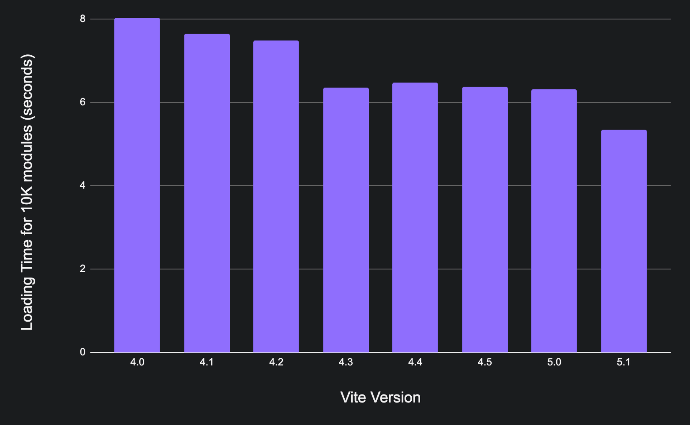

# Вышел Vite 5.1!

_8 февраля 2024_

Vite 5 [вышел](./announcing-vite5.md) в прошлом ноябре и стал ещё одним большим шагом для Vite и экосистемы. Несколько недель назад мы отметили 10 млн еженедельных загрузок с npm и 900 контрибьюторов репозитория Vite. Сегодня рады объявить о выходе Vite 5.1.

Быстрые ссылки: [Документация](/), [Changelog](https://github.com/vitejs/vite/blob/main/packages/vite/CHANGELOG.md#510-2024-02-08)

Документация на других языках: [简体中文](https://cn.vite.dev/), [日本語](https://ja.vite.dev/), [Español](https://es.vite.dev/), [Português](https://pt.vite.dev/), [한국어](https://ko.vite.dev/), [Deutsch](https://de.vite.dev/)

Попробуйте Vite 5.1 онлайн в StackBlitz: [vanilla](https://vite.new/vanilla-ts), [vue](https://vite.new/vue-ts), [react](https://vite.new/react-ts), [preact](https://vite.new/preact-ts), [lit](https://vite.new/lit-ts), [svelte](https://vite.new/svelte-ts), [solid](https://vite.new/solid-ts), [qwik](https://vite.new/qwik-ts).

Если вы новичок в Vite, сначала прочитайте [Начало работы](/guide/) и [Возможности](/guide/features).

Чтобы не пропускать новости, подписывайтесь на [X](https://x.com/vite_js) или [Mastodon](https://webtoo.ls/@vite).

## Vite Runtime API

Vite 5.1 добавляет экспериментальную поддержку нового Vite Runtime API. Он позволяет выполнять любой код после обработки плагинами Vite. В отличие от `server.ssrLoadModule` реализация рантайма отделена от сервера — авторам библиотек и фреймворков проще строить свой слой связи сервер ↔ рантайм. После стабилизации API должен заменить текущие примитивы SSR в Vite.

Преимущества:

- HMR при SSR.
- Нет привязки к серверу — сколько угодно клиентов на один сервер; у каждого свой кэш модулей (связь — как удобно: message channel, fetch, прямой вызов, websocket).
- Не зависит от встроенных API node/bun/deno — подходит для любого окружения.
- Простая интеграция с инструментами со своим способом запуска кода (можно передать runner с `eval` вместо `new AsyncFunction` и т.п.).

Идею изначально [предложил Pooya Parsa](https://github.com/nuxt/vite/pull/201), реализовал [Anthony Fu](https://github.com/antfu) в пакете [vite-node](https://github.com/vitest-dev/vitest/tree/main/packages/vite-node#readme) для [Dev SSR в Nuxt 3](https://antfu.me/posts/dev-ssr-on-nuxt), позже это легло в основу [Vitest](https://vitest.dev). Подход vite-node давно проверен в бою. Новая итерация API — работа [Vladimir Sheremet](https://github.com/sheremet-va), переписавшего vite-node в Vitest и вынесшего выводы в ядро Vite. PR создавался около года; эволюцию и обсуждения с мейнтейнерами экосистемы см. [здесь](https://github.com/vitejs/vite/issues/12165).

::: info
Vite Runtime API эволюционировал в Module Runner API, вышедший в Vite 6 в составе [Environment API](/guide/api-environment).
:::

## Возможности

### Улучшенная поддержка `.css?url`

Импорт CSS как URL теперь работает стабильно и предсказуемо. Это снимало последнее препятствие для перехода Remix на Vite. См. ([#15259](https://github.com/vitejs/vite/issues/15259)).

### `build.assetsInlineLimit` поддерживает callback

Можно [передать callback](/config/build-options.html#build-assetsinlinelimit), возвращающий boolean для выбора инлайна конкретных ассетов. При `undefined` срабатывает логика по умолчанию. См. ([#15366](https://github.com/vitejs/vite/issues/15366)).

### Улучшенный HMR при циклических импортах

В Vite 5.0 принятые модули в циклах всегда вызывали полную перезагрузку страницы, даже если на клиенте можно обойтись без неё. Теперь это смягчено: HMR без full reload, но при ошибке HMR страница перезагрузится. См. ([#15118](https://github.com/vitejs/vite/issues/15118)).

### `ssr.external: true` — внешние все SSR-пакеты

Раньше Vite внешним делал все пакеты, кроме linked. Новая опция принудительно внешнит все, включая linked — удобно в тестах монореп, где нужен типичный сценарий «всё внешнее», или при `ssrLoadModule` для произвольного файла, когда HMR не важен и пакеты всегда внешние. См. ([#10939](https://github.com/vitejs/vite/issues/10939)).

### Метод `close` у preview-сервера

Preview-сервер экспортирует `close` — корректно завершает сервер и все сокеты. См. ([#15630](https://github.com/vitejs/vite/issues/15630)).

## Улучшения производительности

Vite с каждым релизом быстрее; в 5.1 — пакет оптимизаций. Мы замеряли загрузку 10K модулей (дерево на 25 уровней) через [vite-dev-server-perf](https://github.com/yyx990803/vite-dev-server-perf) для миноров с Vite 4.0 — хороший бенч для bundle-less подхода. Каждый модуль — небольшой TypeScript с счётчиком и импортами, то есть в основном время на отдельные запросы модулей. В Vite 4.0 10K модулей на M1 MAX загружались 8 с. Прорыв в [Vite 4.3 с фокусом на производительность](./announcing-vite4-3.md) дал 6,35 с. В Vite 5.1 — ещё шаг: 10K модулей за 5,35 с.

Результаты бенчмарка на Headless Puppeteer хорошо сравнивают версии, но не равны ощущениям пользователя. Те же 10K модулей в инкогнито Chrome:

| 10K модулей           | Vite 5.0 | Vite 5.1 |
| --------------------- | :------: | :------: |
| Время загрузки        |  2892ms  |  2765ms  |
| Загрузка (кэш)        |  2778ms  |  2477ms  |
| Полная перезагрузка   |  2003ms  |  1878ms  |
| Полная перезагрузка (кэш) |  1682ms  |  1604ms  |

### CSS-препроцессоры в потоках

Опционально CSS-препроцессоры можно гонять в worker-потоках: [`css.preprocessorMaxWorkers: true`](/config/shared-options.html#css-preprocessormaxworkers). На проекте Vuetify 2 время старта dev сократилось на 40%. [Сравнения для других сетапов в PR](https://github.com/vitejs/vite/pull/13584#issuecomment-1678827918). См. ([#13584](https://github.com/vitejs/vite/issues/13584)). [Обратная связь](https://github.com/vitejs/vite/discussions/15835).

### Новые опции для холодного старта сервера

`optimizeDeps.holdUntilCrawlEnd: false` переключает стратегию оптимизации deps — может помочь в крупных проектах. Возможно, сделаем её дефолтом позже. [Обратная связь](https://github.com/vitejs/vite/discussions/15834). ([#15244](https://github.com/vitejs/vite/issues/15244))

### Быстрее резолв с кэшированными проверками

Оптимизация `fs.cachedChecks` включена по умолчанию. На Windows `tryFsResolve` стал ~в 14 раз быстрее, общий резолв в triangle benchmark — ~в 5 раз. ([#15704](https://github.com/vitejs/vite/issues/15704))

### Внутренние улучшения

Несколько инкрементальных выигрышей dev-сервера: middleware для short-circuit 304 ([#15586](https://github.com/vitejs/vite/issues/15586)), убрали `parseRequest` из hot paths ([#15617](https://github.com/vitejs/vite/issues/15617)), Rollup лениво подгружается ([#15621](https://github.com/vitejs/vite/issues/15621))

## Устаревание

Продолжаем сужать публичную поверхность API ради долгосрочной поддерживаемости.

### Устарела опция `as` в `import.meta.glob`

Стандарт движется к [Import Attributes](https://github.com/tc39/proposal-import-attributes); замену `as` новой опцией пока не планируем — рекомендуем перейти на `query`. См. ([#14420](https://github.com/vitejs/vite/issues/14420)).

### Удалён экспериментальный pre-bundling на этапе сборки

Эксперимент из Vite 3 убран: у Rollup 4 нативный парсер, идёт Rolldown — история про производительность и несогласованность dev/build для этой фичи больше не актуальна. Цель — согласованность dev/build; Rolldown для «prebundle в dev» и production-сборок выглядит перспективнее, плюс кэш при сборке может быть эффективнее pre-bundling deps. См. ([#15184](https://github.com/vitejs/vite/issues/15184)).

## Участвуйте

Благодарим [900 контрибьюторов ядра Vite](https://github.com/vitejs/vite/graphs/contributors) и мейнтейнеров плагинов, интеграций, инструментов и переводов. Если Vite вам нравится — присоединяйтесь: [Contributing Guide](https://github.com/vitejs/vite/blob/main/CONTRIBUTING.md), [issues](https://github.com/vitejs/vite/issues), [PR](https://github.com/vitejs/vite/pulls), [Discussions](https://github.com/vitejs/vite/discussions) и [Vite Land](https://chat.vite.dev).

## Благодарности

Vite 5.1 возможен благодаря сообществу, мейнтейнерам экосистемы и [команде Vite](/team). Спасибо спонсорам: [StackBlitz](https://stackblitz.com/), [Nuxt Labs](https://nuxtlabs.com/), [Astro](https://astro.build) за найм членов команды; спонсорам на [GitHub Sponsors Vite](https://github.com/sponsors/vitejs), [Open Collective Vite](https://opencollective.com/vite) и [GitHub Sponsors Evan You](https://github.com/sponsors/yyx990803).
