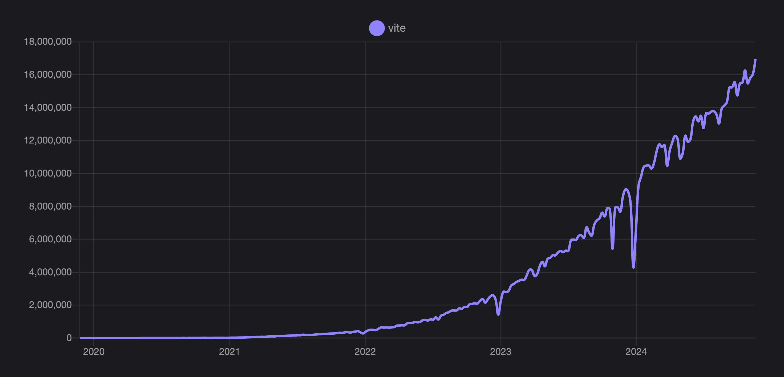

# Вышел Vite 6.0!

_26 ноября 2024_

Сегодня — ещё один крупный шаг в истории Vite. [Команда](/team) Vite, [контрибьюторы](https://github.com/vitejs/vite/graphs/contributors) и партнёры экосистемы рады объявить о выходе Vite 6.

Год выдался насыщенным. Внедрение Vite растёт: с релиза Vite 5 год назад еженедельные загрузки с npm подскочили с 7,5 млн до 17 млн. [Vitest](https://vitest.dev) выбирают чаще и формирует свою экосистему — например, в [Storybook](https://storybook.js.org) появились тесты на Vitest.

К экосистеме присоединились новые фреймворки: [TanStack Start](https://tanstack.com/start), [One](https://onestack.dev/), [Ember](https://emberjs.com/) и другие. Веб-фреймворки развиваются всё быстрее. Смотрите, что делают в [Astro](https://astro.build/), [Nuxt](https://nuxt.com/), [SvelteKit](https://kit.svelte.dev/), [Solid Start](https://www.solidjs.com/blog/introducing-solidstart), [Qwik City](https://qwik.builder.io/qwikcity/overview/), [RedwoodJS](https://redwoodjs.com/), [React Router](https://reactrouter.com/) — список можно продолжать.

Vite используют OpenAI, Google, Apple, Microsoft, NASA, Shopify, Cloudflare, GitLab, Reddit, Linear и многие другие. Два месяца назад мы завели список [компаний, использующих Vite](https://github.com/vitejs/companies-using-vite). Рады PR с добавлением компаний. Трудно поверить, насколько выросла экосистема с первых шагов Vite.

## Ускорение экосистемы Vite

В прошлом месяце прошла третья [ViteConf](https://viteconf.org/24/replay) снова на [StackBlitz](https://stackblitz.com) — самая крупная конференция с широким составом участников. Среди прочего Evan You анонсировал [VoidZero](https://staging.voidzero.dev/posts/announcing-voidzero-inc) — компанию с открытым исходным кодом, высокопроизводительным и единым toolchain для JavaScript. За [Rolldown](https://rolldown.rs) и [Oxc](https://oxc.rs) стоит VoidZero; команда быстро готовит их к интеграции в Vite. Ключевой доклад Evan — про следующие шаги и rust-будущее Vite.

<YouTubeVideo videoId="EKvvptbTx6k?si=EZ-rFJn4pDW3tUvp" />

[Stackblitz](https://stackblitz.com) представил [bolt.new](https://bolt.new) — Remix-приложение с Claude и WebContainers: промпт, правка, запуск и деплой full-stack приложений. Nate Weiner анонсировал [One](https://onestack.dev/) — новый React-фреймворк на Vite для web и native. Storybook показал свежие возможности тестирования на Vitest ([testing features](https://youtu.be/8t5wxrFpCQY?si=PYZoWKf-45goQYDt)). И многое другое — смотрите [все 43 доклада](https://www.youtube.com/playlist?list=PLqGQbXn_GDmnObDzgjUF4Krsfl6OUKxtp).

У Vite обновились лендинг и домен: дальше ориентируйтесь на [vite.dev](https://vite.dev). Дизайн и реализацию сделала VoidZero (те же люди, что и их сайт). Спасибо [Vicente Rodriguez](https://bento.me/rmoon) и [Simon Le Marchant](https://marchantweb.com/).

## Следующий мажор уже здесь

Vite 6 — самый значимый мажор с Vite 2. Мы хотим вместе с экосистемой расширять общее поле новыми API и, как обычно, более отполированной базой.

Быстрые ссылки:

- [Документация](/)
- Переводы: [简体中文](https://cn.vite.dev/), [日本語](https://ja.vite.dev/), [Español](https://es.vite.dev/), [Português](https://pt.vite.dev/), [한국어](https://ko.vite.dev/), [Deutsch](https://de.vite.dev/)
- [Руководство по миграции](/guide/migration)
- [Changelog на GitHub](https://github.com/vitejs/vite/blob/main/packages/vite/CHANGELOG.md#600-2024-11-26)

Новичкам советуем [Начало работы](/guide/) и [Возможности](/guide/features).

Спасибо более чем [1K контрибьюторам ядра Vite](https://github.com/vitejs/vite/graphs/contributors) и всем, кто развивает плагины, интеграции, инструменты и переводы. Присоединяйтесь — [Contributing Guide](https://github.com/vitejs/vite/blob/main/CONTRIBUTING.md).

Начать можно с [разбора issues](https://github.com/vitejs/vite/issues), [ревью PR](https://github.com/vitejs/vite/pulls), PR с падающими тестами и помощи в [Discussions](https://github.com/vitejs/vite/discussions) и [форуме помощи](https://discord.com/channels/804011606160703521/1019670660856942652) Vite Land. Вопросы — [Discord](https://chat.vite.dev), [#contributing](https://discord.com/channels/804011606160703521/804439875226173480).

Новости экосистемы и ядра — [Bluesky](https://bsky.app/profile/vite.dev), [X](https://twitter.com/vite_js), [Mastodon](https://webtoo.ls/@vite).

## Начало работы с Vite 6

`pnpm create vite` — быстрый каркас приложения с нужным фреймворком; онлайн — [vite.new](https://vite.new). `pnpm create vite-extra` — шаблоны других фреймворков и рантаймов (Solid, Deno, SSR, библиотеки); те же шаблоны в `create vite` → `Others`.

Стартовые шаблоны — площадка для экспериментов. Для продакшена берите рекомендованные фреймворками стартеры. В `create vite` есть ярлыки: `create-vue`, `Nuxt 3`, `SvelteKit`, `Remix`, `Analog`, `Angular`.

## Поддержка Node.js

Vite 6 поддерживает Node.js 18, 20 и 22+, как Vite 5. Node.js 21 снят. Старые версии Node отпадают после [EOL](https://endoflife.date/nodejs). EOL Node.js 18 — конец апреля 2025; после этого возможен новый мажор с повышением требований к Node.

## Экспериментальный Environment API

Vite становится гибче с Environment API: фреймворки смогут приблизить dev к production, экосистема — делиться новыми кирпичиками. Для SPA ничего не меняется: один client environment — всё как раньше. Кастомные SSR-приложения в Vite 6 совместимы назад. Основная аудитория API — авторы фреймворков.

Для любопытных [Sapphi](https://github.com/sapphi-red) написал отличное [введение в Environment API](https://green.sapphi.red/blog/increasing-vites-potential-with-the-environment-api) — с чего начать и зачем мы усложняем Vite осознанно.

Авторам фреймворков и плагинов — [Environment API Guides](https://main.vite.dev/guide/api-environment).

Спасибо всем, кто формулировал и внедрял API. Начало — unbundled SSR dev в Vite 2 от [Rich Harris](https://github.com/Rich-Harris) и команды [SvelteKit](https://svelte.dev/docs/kit). SSR-трансформ Vite дал [Anthony Fu](https://github.com/antfu/) и [Pooya Parsa](https://github.com/pi0) создать vite-node и улучшить [Dev SSR в Nuxt](https://antfu.me/posts/dev-ssr-on-nuxt). Anthony взял vite-node в [Vitest](https://vitest.dev), [Vladimir Sheremet](https://github.com/sheremet-va) развивал его в Vitest. В начале 2023 Vladimir начал перенос в ядро Vite; год спустя это вышло как Runtime API в Vite 5.1. Обратная связь (особенно Cloudflare) подтолкнула к более смелой переработке окружений. История — в [докладе Patak на ViteConf 24](https://www.youtube.com/watch?v=WImor3HDyqU?si=EZ-rFJn4pDW3tUvp).

Вся команда Vite участвовала в дизайне API совместно с проектами экосистемы. API экспериментальные; со следующим мажором стабилизируем вместе с экосистемой. Вопросы и фидбек — [открытое обсуждение на GitHub](https://github.com/vitejs/vite/discussions/16358).

## Основные изменения

- [Значение по умолчанию для `resolve.conditions`](/guide/migration#default-value-for-resolve-conditions)
- [JSON stringify](/guide/migration#json-stringify)
- [Расширенная поддержка ссылок на ассеты в HTML](/guide/migration#extended-support-of-asset-references-in-html-elements)
- [postcss-load-config](/guide/migration#postcss-load-config)
- [Sass по умолчанию на modern API](/guide/migration#sass-now-uses-modern-api-by-default)
- [Имя CSS-файла в library mode](/guide/migration#customize-css-output-file-name-in-library-mode)
- [И прочие изменения для узкой аудитории](/guide/migration#advanced)

Новая страница [Breaking Changes](/changes/) — запланированные, обсуждаемые и прошлые изменения.

## Миграция на Vite 6

Для большинства проектов обновление простое; перед апгрейдом изучите [руководство по миграции](/guide/migration).

Полный список — в [changelog Vite 6](https://github.com/vitejs/vite/blob/main/packages/vite/CHANGELOG.md#500-2024-11-26).

## Благодарности

Vite 6 — результат долгой работы контрибьюторов, downstream-мейнтейнеров, авторов плагинов и [команды Vite](/team). Спасибо спонсорам. Vite развивают [VoidZero](https://voidzero.dev) совместно со [StackBlitz](https://stackblitz.com/), [Nuxt Labs](https://nuxtlabs.com/) и [Astro](https://astro.build). Спасибо спонсорам на [GitHub Sponsors](https://github.com/sponsors/vitejs) и [Open Collective](https://opencollective.com/vite).
