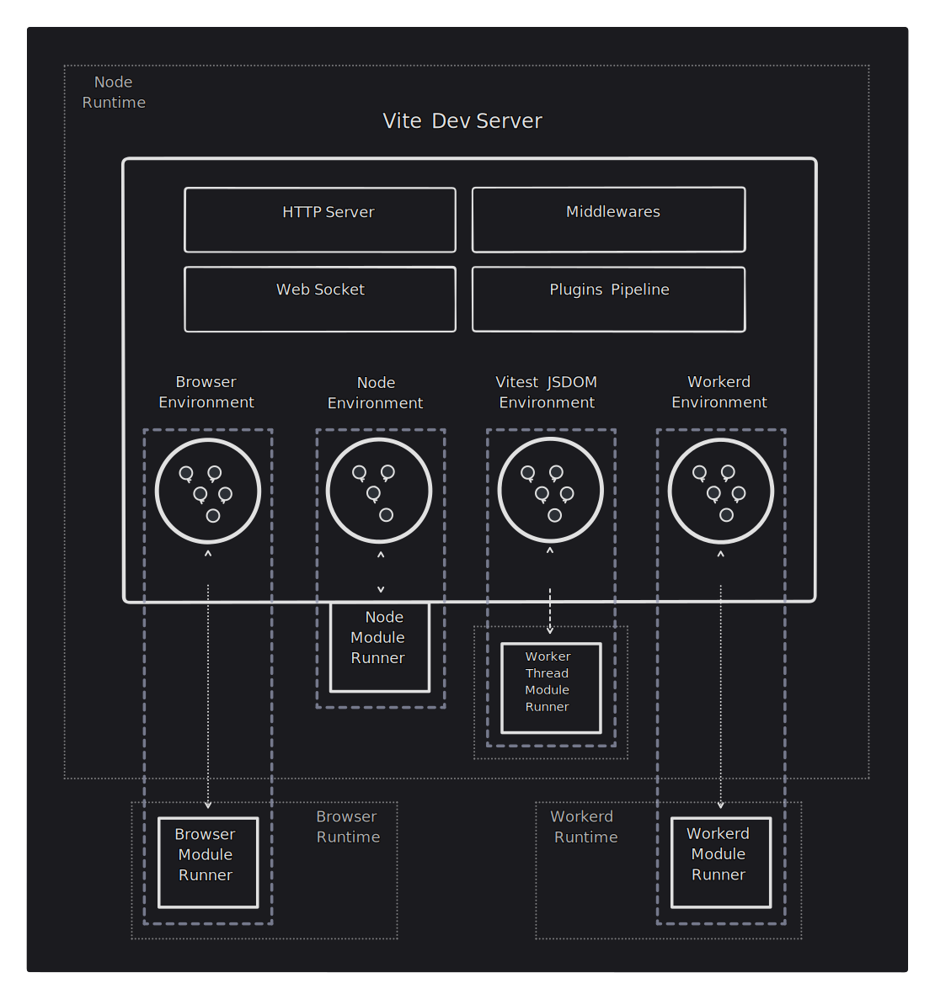

# API окружений (Environment API)

:::info Кандидат на релиз
Environment API в целом находится в фазе кандидата на релиз. Мы будем поддерживать стабильность API между мажорными релизами, чтобы экосистема могла экспериментировать и строить на их основе. Однако имейте в виду, что [некоторые конкретные API](/changes/#considering) всё ещё считаются экспериментальными.

Мы планируем стабилизировать эти новые API (с возможными breaking changes) в будущем мажорном релизе, когда даунстрим-проекты успеют поэкспериментировать с новыми возможностями и проверить их.

Материалы:

- [Обсуждение и обратная связь](https://github.com/vitejs/vite/discussions/16358), где мы собираем отзывы о новых API.
- [PR Environment API](https://github.com/vitejs/vite/pull/16471), где новые API были реализованы и ревьюились.

Поделитесь с нами своей обратной связью.
:::

## Формализация окружений

Vite 6 формализует концепцию окружений (Environments). До Vite 5 существовали два неявных окружения (`client` и при необходимости `ssr`). Новый Environment API позволяет пользователям и авторам фреймворков создавать столько окружений, сколько нужно, чтобы отразить, как приложение работает в продакшене. Для этой возможности потребовался большой внутренний рефакторинг, но много сил уделено обратной совместимости. Первоначальная цель Vite 6 — максимально плавно перевести экосистему на новый мажор, отложив активное использование API до тех пор, пока достаточно пользователей не мигрирует, а фреймворки и авторы плагинов не подтвердят новый дизайн.

## Сближение сборки и разработки

Для простого SPA/MPA новые API вокруг окружений в конфиг не выставляются. Внутри Vite применяет опции к окружению `client`, но при настройке Vite знать об этой концепции не обязательно. Конфиг и поведение как в Vite 5 здесь должны работать без сбоев.

У типичного приложения с рендерингом на сервере (SSR) будет два окружения:

- `client`: выполняет приложение в браузере.
- `ssr`: выполняет приложение в Node (или других серверных рантаймах), который рендерит страницы до отправки в браузер.

В режиме разработки Vite выполняет серверный код в том же процессе Node, что и dev-сервер Vite, что даёт близкое приближение к продакшен-окружению. Однако серверы могут работать и в других JS-рантаймах, например в [workerd от Cloudflare](https://github.com/cloudflare/workerd), с иными ограничениями. Современные приложения могут работать более чем в двух окружениях — например, браузер, Node-сервер и edge-сервер. Vite 5 не позволял корректно моделировать такие окружения.

Vite 6 позволяет настраивать приложение при сборке и в dev так, чтобы отразить все его окружения. В dev один dev-сервер Vite может одновременно выполнять код в нескольких разных окружениях. Исходный код приложения по-прежнему трансформируется dev-сервером Vite. Поверх общего HTTP-сервера, middleware, резолвнутого конфига и пайплайна плагинов у dev-сервера Vite теперь есть набор независимых dev-окружений. Каждое настроено максимально близко к продакшену и подключено к dev-рантайму, где выполняется код (для workerd серверный код может локально работать в miniflare). В клиенте браузер импортирует и выполняет код. В других окружениях module runner запрашивает и выполняет трансформированный код.



## Настройка окружений

Для SPA/MPA конфигурация будет похожа на Vite 5. Внутри эти опции используются для настройки окружения `client`.

```js
export default defineConfig({
  build: {
    sourcemap: false,
  },
  optimizeDeps: {
    include: ['lib'],
  },
})
```

Это важно: мы хотим, чтобы Vite оставался доступным, и не выставляли новые концепции, пока они не нужны.

Если приложение состоит из нескольких окружений, их можно явно задать опцией конфига `environments`.

```js
export default {
  build: {
    sourcemap: false,
  },
  optimizeDeps: {
    include: ['lib'],
  },
  environments: {
    server: {},
    edge: {
      resolve: {
        noExternal: true,
      },
    },
  },
}
```

Если не сказано иное, окружение наследует настроенные опции верхнего уровня (например, новые окружения `server` и `edge` унаследуют `build.sourcemap: false`). Небольшая часть опций верхнего уровня, таких как `optimizeDeps`, применяется только к окружению `client`, так как плохо работают как значение по умолчанию для серверных окружений. У таких опций в [справочнике](/config/) есть бейдж <NonInheritBadge />. Окружение `client` можно также настроить явно через `environments.client`, но мы рекомендуем использовать опции верхнего уровня, чтобы конфиг клиента не менялся при добавлении новых окружений.

Интерфейс `EnvironmentOptions` описывает все опции, задаваемые на уровне окружения. Есть опции, относящиеся и к `build`, и к `dev`, например `resolve`. А также `DevEnvironmentOptions` и `BuildEnvironmentOptions` для специфичных для dev и build опций (например `dev.warmup` или `build.outDir`). Некоторые опции вроде `optimizeDeps` относятся только к dev, но остаются на верхнем уровне, а не внутри `dev`, ради обратной совместимости.

```ts
interface EnvironmentOptions {
  define?: Record<string, any>
  resolve?: EnvironmentResolveOptions
  optimizeDeps: DepOptimizationOptions
  consumer?: 'client' | 'server'
  dev: DevOptions
  build: BuildOptions
}
```

Интерфейс `UserConfig` расширяет `EnvironmentOptions` и позволяет настроить клиент и значения по умолчанию для других окружений через опцию `environments`. Окружения `client` и серверное с именем `ssr` всегда присутствуют в dev. Это сохраняет обратную совместимость с `server.ssrLoadModule(url)` и `server.moduleGraph`. При сборке окружение `client` всегда есть, а `ssr` — только если оно явно настроено (через `environments.ssr` или для совместимости `build.ssr`). Приложению не обязательно называть SSR-окружение `ssr` — можно, например, `server`.

```ts
interface UserConfig extends EnvironmentOptions {
  environments: Record<string, EnvironmentOptions>
  // other options
}
```

Имейте в виду: свойство верхнего уровня `ssr` будет помечено устаревшим после стабилизации Environment API. Оно выполняет ту же роль, что и `environments`, но только для окружения `ssr` по умолчанию и позволяет задать ограниченный набор опций.

## Пользовательские экземпляры окружений

Доступны низкоуровневые API конфигурации, чтобы провайдеры рантаймов могли предлагать окружения с корректными умолчанями для своих рантаймов. Такие окружения могут также порождать другие процессы или потоки для выполнения модулей в dev в рантайме, ближе к продакшену.

Например, [плагин Cloudflare Vite](https://developers.cloudflare.com/workers/vite-plugin/) использует Environment API для выполнения кода в рантайме Cloudflare Workers (`workerd`) во время разработки.

```js
import { customEnvironment } from 'vite-environment-provider'

export default {
  build: {
    outDir: '/dist/client',
  },
  environments: {
    ssr: customEnvironment({
      build: {
        outDir: '/dist/ssr',
      },
    }),
  },
}
```

## Обратная совместимость

Текущий API сервера Vite ещё не помечен устаревшим и совместим с Vite 5.

`server.moduleGraph` возвращает смешанное представление графов модулей client и ssr. Из всех его методов возвращаются узлы модулей, совместимые со старым API. Та же схема используется для узлов модулей, передаваемых в `handleHotUpdate`.

Мы пока не рекомендуем переходить на Environment API. Рассчитываем, что значительная часть пользователей перейдёт на Vite 6 раньше, чтобы плагинам не пришлось поддерживать две версии. Раздел о будущих breaking changes и пути миграции:

- [`this.environment` в хуках](/changes/this-environment-in-hooks)
- [Плагинный хук HMR `hotUpdate`](/changes/hotupdate-hook)
- [Переход к per-environment API](/changes/per-environment-apis)
- [SSR с API `ModuleRunner`](/changes/ssr-using-modulerunner)
- [Общие плагины при сборке](/changes/shared-plugins-during-build)

## Целевая аудитория

В этом руководстве — базовые концепции окружений для конечных пользователей.

Авторам плагинов доступен более единообразный API для работы с конфигурацией текущего окружения. Если вы строите решение поверх Vite, в [руководстве Environment API для плагинов](./api-environment-plugins.md) описано, как расширенные API плагинов поддерживают несколько пользовательских окружений.

Фреймворки могут выставлять окружения на разных уровнях. Если вы автор фреймворка, продолжайте с [руководством Environment API для фреймворков](./api-environment-frameworks), чтобы узнать о программной стороне Environment API.

Для провайдеров рантаймов в [руководстве Environment API для рантаймов](./api-environment-runtimes.md) объясняется, как предлагать пользовательские окружения для фреймворков и пользователей.
