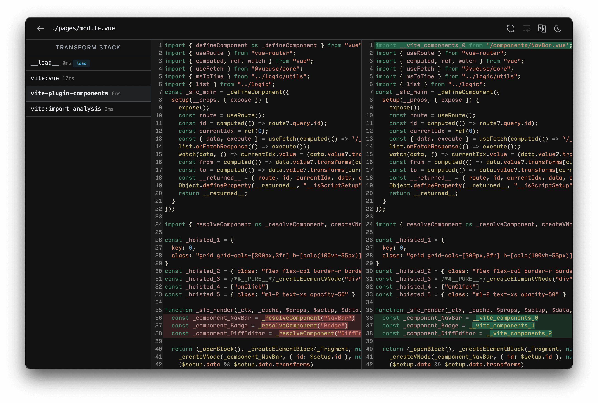

# API плагинов

Плагины Vite расширяют интерфейс плагинов Rolldown несколькими опциями, специфичными для Vite. Один плагин Vite можно написать один раз и использовать и в dev, и в build.

**Сначала рекомендуется прочитать [документацию по плагинам Rolldown](https://rolldown.rs/apis/plugin-api), затем разделы ниже.**

## Создание плагина

Vite стремится давать готовые паттерны: перед новым плагином проверьте [руководство по возможностям](/guide/features) и существующие плагины — [совместимые с Rollup](https://github.com/rollup/awesome) и [специфичные для Vite](https://github.com/vitejs/awesome-vite#plugins).

Плагин можно описать прямо в `vite.config.js`, отдельный пакет не обязателен. Если плагин оказался полезен — поделитесь им с [экосистемой](https://chat.vite.dev).

::: tip
При изучении, отладке и написании плагинов полезен [vite-plugin-inspect](https://github.com/antfu/vite-plugin-inspect): видно промежуточное состояние плагинов Vite. После установки откройте `localhost:5173/__inspect/`. Инструкции — в [документации vite-plugin-inspect](https://github.com/antfu/vite-plugin-inspect).

:::

## Соглашения

Если плагин не использует специфичные для Vite хуки и может быть [совместимым плагином Rolldown](#rolldown-plugin-compatibility), следуйте [соглашениям об именовании плагинов Rolldown](https://rolldown.rs/apis/plugin-api#conventions).

- У плагинов Rolldown должно быть понятное имя с префиксом `rolldown-plugin-`.
- В поле `keywords` в package.json укажите `rolldown-plugin` и `vite-plugin`.

Так плагин можно использовать и в чистом Rolldown/Rollup.

Только для Vite:

- Имя с префиксом `vite-plugin-`.
- Ключевое слово `vite-plugin` в `keywords`.
- В документации плагина объясните, почему он только для Vite (например, использует специфичные хуки).

Если плагин заточен под фреймворк, включите его в префикс:

- `vite-plugin-vue-` для Vue
- `vite-plugin-react-` для React
- `vite-plugin-svelte-` для Svelte

См. также [соглашение о виртуальных модулях](#virtual-modules-convention).

## Настройка плагинов

Плагины добавляют в `devDependencies` и подключают в массиве `plugins`.

```js [vite.config.js]
import vitePlugin from 'vite-plugin-feature'
import rollupPlugin from 'rollup-plugin-feature'

export default defineConfig({
  plugins: [vitePlugin(), rollupPlugin()],
})
```

Ложные значения в списке плагинов игнорируются — удобно включать/выключать плагины.

В `plugins` можно передать пресет — один элемент, за которым стоит несколько плагинов (например интеграция фреймворка). Массив внутри выравнивается (flatten).

```js
// framework-plugin
import frameworkRefresh from 'vite-plugin-framework-refresh'
import frameworkDevtools from 'vite-plugin-framework-devtools'

export default function framework(config) {
  return [frameworkRefresh(config), frameworkDevTools(config)]
}
```

```js [vite.config.js]
import { defineConfig } from 'vite'
import framework from 'vite-plugin-framework'

export default defineConfig({
  plugins: [framework()],
})
```

## Простые примеры

:::tip
Обычно плагин Vite/Rolldown/Rollup оформляют фабрикой, возвращающей объект плагина. Фабрика может принимать опции настройки.
:::

### Трансформация своих типов файлов

```js
const fileRegex = /\.(my-file-ext)$/

export default function myPlugin() {
  return {
    name: 'transform-file',

    transform: {
      filter: {
        id: fileRegex,
      },
      handler(src, id) {
        return {
          code: compileFileToJS(src),
          map: null, // provide source map if available
        }
      },
    },
  }
}
```

### Импорт виртуального файла

Пример в [следующем разделе](#virtual-modules-convention).

## Соглашение о виртуальных модулях {#virtual-modules-convention}

Виртуальные модули передают в исходники информацию времени сборки через обычный синтаксис ESM-импорта.

```js
import { exactRegex } from '@rolldown/pluginutils'

export default function myPlugin() {
  const virtualModuleId = 'virtual:my-module'
  const resolvedVirtualModuleId = '\0' + virtualModuleId

  return {
    name: 'my-plugin', // required, will show up in warnings and errors
    resolveId: {
      filter: { id: exactRegex(virtualModuleId) },
      handler() {
        return resolvedVirtualModuleId
      },
    },
    load: {
      filter: { id: exactRegex(resolvedVirtualModuleId) },
      handler() {
        return `export const msg = "from virtual module"`
      },
    },
  }
}
```

Импорт в JavaScript:

```js
import { msg } from 'virtual:my-module'

console.log(msg)
```

Для пользовательского пути виртуальные модули в Vite (и Rolldown/Rollup) по соглашению начинаются с `virtual:`. По возможности используйте имя плагина как пространство имён. Например, `vite-plugin-posts` может предлагать `virtual:posts` или `virtual:posts/helpers`. Внутри при resolve id виртуального модуля к нему добавляют префикс `\0` (соглашение экосистемы Rollup): другие плагины не пытаются резолвить такой id как обычный файл, sourcemap’ы различают виртуальные и обычные модули. `\0` нельзя в URL импорта, поэтому при анализе импортов id кодируется; в dev в браузере `\0{id}` становится `/@id/__x00__{id}`. Перед конвейером плагинов id снова декодируется — в коде хуков это не видно.

Модули, производные от реального файла (например скрипт в SFC `.vue`/`.svelte`), этому соглашению не обязаны: подмодули SFC маппятся на ФС, `\0` для них сломал бы sourcemap’ы.

## Универсальные хуки

В dev dev-сервер Vite создаёт контейнер плагинов и вызывает [Rolldown Build Hooks](https://rolldown.rs/apis/plugin-api#build-hooks) так же, как Rolldown.

Следующие хуки вызываются один раз при старте сервера:

- [`options`](https://rolldown.rs/reference/interface.plugin#options)
- [`buildStart`](https://rolldown.rs/reference/Interface.Plugin#buildstart)

Следующие хуки — на каждый запрос модуля:

- [`resolveId`](https://rolldown.rs/reference/Interface.Plugin#resolveid)
- [`load`](https://rolldown.rs/reference/Interface.Plugin#load)
- [`transform`](https://rolldown.rs/reference/Interface.Plugin#transform)

У этих хуков расширенный параметр `options` с полями, специфичными для Vite. Подробнее — в [документации по SSR](/guide/ssr#ssr-specific-plugin-logic).

У части вызовов `resolveId` поле `importer` может быть абсолютным путём к корневому `index.html`: в режиме без бандла не всегда удаётся восстановить реального импортёра. Для импортов внутри пайплайна resolve Vite `importer` отслеживается на этапе анализа импорта.

При закрытии сервера вызываются:

- [`buildEnd`](https://rolldown.rs/reference/Interface.Plugin#buildend)
- [`closeBundle`](https://rolldown.rs/reference/Interface.Plugin#closebundle)

Хук [`moduleParsed`](https://rolldown.rs/reference/Interface.Plugin#moduleparsed) в **dev не вызывается** — Vite избегает полного разбора AST ради производительности.

[Output Generation Hooks](https://rolldown.rs/apis/plugin-api#output-generation-hooks) (кроме `closeBundle`) в **dev не вызываются**.

## Специфичные для Vite хуки

Плагины Vite могут объявлять хуки только для Vite; Rollup их игнорирует.

### `config`

- **Тип:** `(config: UserConfig, env: { mode: string, command: string }) => UserConfig | null | void`
- **Вид:** `async`, `sequential`

  Изменяет конфиг Vite до его финального разрешения. На вход — сырой пользовательский конфиг (CLI + файл) и окружение конфига с `mode` и `command`. Можно вернуть частичный объект для глубокого слияния или мутировать конфиг, если слияния недостаточно.

  **Пример:**

  ```js
  // return partial config (recommended)
  const partialConfigPlugin = () => ({
    name: 'return-partial',
    config: () => ({
      resolve: {
        alias: {
          foo: 'bar',
        },
      },
    }),
  })

  // mutate the config directly (use only when merging doesn't work)
  const mutateConfigPlugin = () => ({
    name: 'mutate-config',
    config(config, { command }) {
      if (command === 'build') {
        config.root = 'foo'
      }
    },
  })
  ```

  ::: warning Примечание
  Пользовательские плагины резолвятся до этого хука, поэтому добавление плагинов внутри хука `config` не сработает.
  :::

### `configResolved`

- **Тип:** `(config: ResolvedConfig) => void | Promise<void>`
- **Вид:** `async`, `parallel`

  Вызывается после разрешения конфига Vite. Удобно сохранить итоговый конфиг и ветвить логику по команде.

  **Пример:**

  ```js
  const examplePlugin = () => {
    let config

    return {
      name: 'read-config',

      configResolved(resolvedConfig) {
        // store the resolved config
        config = resolvedConfig
      },

      // use stored config in other hooks
      transform(code, id) {
        if (config.command === 'serve') {
          // dev: plugin invoked by dev server
        } else {
          // build: plugin invoked by Rollup
        }
      },
    }
  }
  ```

  В dev `command` равен `serve` (в CLI это `vite`, `vite dev`, `vite serve`).

### `configureServer`

- **Тип:** `(server: ViteDevServer) => (() => void) | void | Promise<(() => void) | void>`
- **Вид:** `async`, `sequential`
- **См. также:** [ViteDevServer](./api-javascript#vitedevserver)

  Настройка dev-сервера. Чаще всего — свои middleware для внутреннего приложения [connect](https://github.com/senchalabs/connect):

  ```js
  const myPlugin = () => ({
    name: 'configure-server',
    configureServer(server) {
      server.middlewares.use((req, res, next) => {
        // custom handle request...
      })
    },
  })
  ```

  **Middleware после встроенных**

  `configureServer` вызывается до установки внутренних middleware, поэтому ваши middleware по умолчанию идут раньше встроенных. Чтобы выполнить middleware **после** внутренних, верните из `configureServer` функцию — её вызовут после установки встроенных middleware:

  ```js
  const myPlugin = () => ({
    name: 'configure-server',
    configureServer(server) {
      // return a post hook that is called after internal middlewares are
      // installed
      return () => {
        server.middlewares.use((req, res, next) => {
          // custom handle request...
        })
      }
    },
  })
  ```

  **Сохранение ссылки на сервер**

  Другим хукам может понадобиться экземпляр dev-сервера (WebSocket, watcher, граф модулей). Здесь можно сохранить `server` для последующих хуков:

  ```js
  const myPlugin = () => {
    let server
    return {
      name: 'configure-server',
      configureServer(_server) {
        server = _server
      },
      transform(code, id) {
        if (server) {
          // use server...
        }
      },
    }
  }
  ```

  При production-сборке `configureServer` не вызывается — в других хуках учитывайте отсутствие сервера.

### `configurePreviewServer`

- **Тип:** `(server: PreviewServer) => (() => void) | void | Promise<(() => void) | void>`
- **Вид:** `async`, `sequential`
- **См. также:** [PreviewServer](./api-javascript#previewserver)

  То же, что [`configureServer`](/guide/api-plugin.html#configureserver), но для preview-сервера. `configurePreviewServer` вызывается до остальных middleware; чтобы вставить middleware **после**, верните функцию — её вызовут после внутренних middleware:

  ```js
  const myPlugin = () => ({
    name: 'configure-preview-server',
    configurePreviewServer(server) {
      // return a post hook that is called after other middlewares are
      // installed
      return () => {
        server.middlewares.use((req, res, next) => {
          // custom handle request...
        })
      }
    },
  })
  ```

### `transformIndexHtml`

- **Тип:** `IndexHtmlTransformHook | { order?: 'pre' | 'post', handler: IndexHtmlTransformHook }`
- **Вид:** `async`, `sequential`

  Трансформация HTML-входов вроде `index.html`. На вход — строка HTML и контекст: в dev доступен [`ViteDevServer`](./api-javascript#vitedevserver), при сборке — бандл Rollup.

  Хук может быть async и возвращать:
  - строку HTML;
  - массив дескрипторов тегов (`{ tag, attrs, children }`) для вставки в HTML (позиция вставки настраивается, по умолчанию — prepend в `<head>`);
  - объект `{ html, tags }`.

  По умолчанию `order` не задан — хук после базовой трансформации HTML. `order: 'pre'` — до обработки HTML (чтобы скрипт прошёл через пайплайн плагинов). `order: 'post'` — после всех хуков без `order`.

  **Базовый пример:**

  ```js
  const htmlPlugin = () => {
    return {
      name: 'html-transform',
      transformIndexHtml(html) {
        return html.replace(
          /<title>(.*?)<\/title>/,
          `<title>Title replaced!</title>`,
        )
      },
    }
  }
  ```

  **Полная сигнатура хука:**

  ```ts
  type IndexHtmlTransformHook = (
    html: string,
    ctx: {
      path: string
      filename: string
      server?: ViteDevServer
      bundle?: import('rollup').OutputBundle
      chunk?: import('rollup').OutputChunk
    },
  ) =>
    | IndexHtmlTransformResult
    | void
    | Promise<IndexHtmlTransformResult | void>

  type IndexHtmlTransformResult =
    | string
    | HtmlTagDescriptor[]
    | {
        html: string
        tags: HtmlTagDescriptor[]
      }

  interface HtmlTagDescriptor {
    tag: string
    /**
     * attribute values will be escaped automatically if needed
     */
    attrs?: Record<string, string | boolean>
    children?: string | HtmlTagDescriptor[]
    /**
     * default: 'head-prepend'
     */
    injectTo?: 'head' | 'body' | 'head-prepend' | 'body-prepend'
  }
  ```

  ::: warning Примечание
  Хук не вызывается, если фреймворк сам обрабатывает входные HTML-файлы (например [SvelteKit](https://github.com/sveltejs/kit/discussions/8269#discussioncomment-4509145)).
  :::

### `handleHotUpdate`

- **Тип:** `(ctx: HmrContext) => Array<ModuleNode> | void | Promise<Array<ModuleNode> | void>`
- **Вид:** `async`, `sequential`
- **См. также:** [HMR API](./api-hmr)

  Своя логика HMR. Контекст:

  ```ts
  interface HmrContext {
    file: string
    timestamp: number
    modules: Array<ModuleNode>
    read: () => string | Promise<string>
    server: ViteDevServer
  }
  ```

  - `modules` — модули, затронутые изменением файла; массив, потому что один файл может дать несколько обслуживаемых модулей (например Vue SFC).

  - `read` — асинхронное чтение содержимого файла: на части систем событие срабатывает до записи редактора, прямой `fs.readFile` может вернуть пусто; `read` это сглаживает.

  Варианты поведения хука:
  - Отфильтровать список модулей для более точного HMR.

  - Вернуть пустой массив и выполнить полную перезагрузку:

    ```js
    handleHotUpdate({ server, modules, timestamp }) {
      // Invalidate modules manually
      const invalidatedModules = new Set()
      for (const mod of modules) {
        server.moduleGraph.invalidateModule(
          mod,
          invalidatedModules,
          timestamp,
          true
        )
      }
      server.ws.send({ type: 'full-reload' })
      return []
    }
    ```

  - Вернуть пустой массив и полностью своё HMR через кастомные события клиенту:

    ```js
    handleHotUpdate({ server }) {
      server.ws.send({
        type: 'custom',
        event: 'special-update',
        data: {}
      })
      return []
    }
    ```

    На клиенте обработчик через [HMR API](./api-hmr) (можно внедрить из `transform` того же плагина):

    ```js
    if (import.meta.hot) {
      import.meta.hot.on('special-update', (data) => {
        // perform custom update
      })
    }
    ```

## Мета контекста плагина

В хуках с доступом к контексту плагина у `this.meta` есть дополнительные поля:

- `this.meta.viteVersion`: строка версии Vite (например `"8.0.0"`).

::: tip Как понять, что Vite на Rolldown

[`this.meta.rolldownVersion`](https://rolldown.rs/reference/Interface.PluginContextMeta#rolldownversion) есть только у Vite на Rolldown (Vite 8+). По нему можно отличить текущий экземпляр:

```ts
function versionCheckPlugin(): Plugin {
  return {
    name: 'version-check',
    buildStart() {
      if (this.meta.rolldownVersion) {
        // only do something if running on a Rolldown powered Vite
      } else {
        // do something else if running on a Rollup powered Vite
      }
    },
  }
}
```

:::

## Метаданные выходного бандла

При сборке Vite дополняет объекты вывода Rolldown полем `viteMetadata`.

Доступно в:

- `RenderedChunk` (например `renderChunk`, `augmentChunkHash`)
- `OutputChunk` и `OutputAsset` (например `generateBundle`, `writeBundle`)

`viteMetadata` содержит:

- `viteMetadata.importedCss: Set<string>`
- `viteMetadata.importedAssets: Set<string>`

Полезно плагинам, которым нужны выпущенные CSS и статические ассеты без [`build.manifest`](/config/build-options#build-manifest).

Пример:

```ts [vite.config.ts]
function outputMetadataPlugin(): Plugin {
  return {
    name: 'output-metadata-plugin',
    generateBundle(_, bundle) {
      for (const output of Object.values(bundle)) {
        const css = output.viteMetadata?.importedCss
        const assets = output.viteMetadata?.importedAssets
        if (!css?.size && !assets?.size) continue

        console.log(output.fileName, {
          css: css ? [...css] : [],
          assets: assets ? [...assets] : [],
        })
      }
    },
  }
}
```

## Порядок плагинов

У плагина Vite может быть `enforce` (как у лоадеров webpack): `"pre"` или `"post"`. Итоговый порядок:

- Alias
- Пользовательские с `enforce: 'pre'`
- Ядро Vite
- Пользовательские без `enforce`
- Плагины сборки Vite
- Пользовательские с `enforce: 'post'`
- Пост-обработка Vite (минификация, манифест, отчёты)

Порядок хуков внутри плагина по-прежнему задаётся атрибутом [`order`](https://rolldown.rs/reference/TypeAlias.ObjectHook#order) у хуков Rolldown.

## Условное подключение

По умолчанию плагины вызываются и в serve, и в build. Чтобы ограничить только `'build'` или `'serve'`, используйте `apply`:

```js
function myPlugin() {
  return {
    name: 'build-only',
    apply: 'build', // or 'serve'
  }
}
```

Точнее — функция:

```js
apply(config, { command }) {
  // apply only on build but not for SSR
  return command === 'build' && !config.build.ssr
}
```

## Совместимость с плагинами Rolldown {#rolldown-plugin-compatibility}

Многие плагины Rolldown/Rollup работают как плагины Vite (`@rollup/plugin-alias`, `@rollup/plugin-json` и т.д.), но не все: часть хуков бессмысленна для dev без бандла.

Обычно плагин подходит, если:

- нет хука [`moduleParsed`](https://rolldown.rs/reference/Interface.Plugin#moduleparsed);
- нет жёсткой зависимости от опций вроде [`transform.inject`](https://rolldown.rs/reference/InputOptions.transform#inject);
- нет тесной связи между хуками фазы бандла и фазы вывода.

Плагин только для сборки можно указать в `build.rolldownOptions.plugins` — эквивалентно Vite-плагину с `enforce: 'post'` и `apply: 'build'`.

К существующему плагину можно добавить только Vite-поля:

```js [vite.config.js]
import example from 'rolldown-plugin-example'
import { defineConfig } from 'vite'

export default defineConfig({
  plugins: [
    {
      ...example(),
      enforce: 'post',
      apply: 'build',
    },
  ],
})
```

## Нормализация путей {#path-normalization}

Vite при resolve id нормализует пути к POSIX-разделителям `/`, сохраняя том в Windows. Rollup по умолчанию оставляет win32-разделители `\\`. Плагины Rollup внутри используют [`normalizePath`](https://github.com/rollup/plugins/tree/master/packages/pluginutils#normalizepath) из `@rollup/pluginutils` перед сравнениями, поэтому `include`/`exclude` с resolved id в Vite часто уже согласованы.

Для своих плагинов Vite при сравнении с resolved id сначала нормализуйте путь к POSIX. Аналог `normalizePath` экспортируется из `vite`.

```js
import { normalizePath } from 'vite'

normalizePath('foo\\bar') // 'foo/bar'
normalizePath('foo/bar') // 'foo/bar'
```

## Фильтрация, паттерны include/exclude

Vite реэкспортирует [`createFilter` из `@rollup/pluginutils`](https://github.com/rollup/plugins/tree/master/packages/pluginutils#createfilter) — стандартный паттерн include/exclude, как в ядре Vite.

### Фильтры хуков

В Rolldown есть [фильтры хуков](https://rolldown.rs/apis/plugin-api/hook-filters), чтобы реже гонять данные между Rust и JS: плагин задаёт паттерны вызова хуков.

Поддерживается в Rollup 4.38.0+ и Vite 6.3.0+. Для старых версий дублируйте проверку внутри обработчика хука.

```js
export default function myPlugin() {
  const jsFileRegex = /\.js$/

  return {
    name: 'my-plugin',
    // Example: only call transform for .js files
    transform: {
      filter: {
        id: jsFileRegex,
      },
      handler(code, id) {
        // Additional check for backward compatibility
        if (!jsFileRegex.test(id)) return null

        return {
          code: transformCode(code),
          map: null,
        }
      },
    },
  }
}
```

::: tip
В [`@rolldown/pluginutils`](https://www.npmjs.com/package/@rolldown/pluginutils) есть утилиты для фильтров хуков (`exactRegex`, `prefixRegex` и др.); их же удобно брать из `rolldown/filter`.
:::

## Обмен клиент–сервер {#client-server-communication}

С Vite 2.9 плагины могут проще общаться с клиентом.

### Сервер → клиент

На стороне плагина — `server.ws.send` для рассылки событий:

```js [vite.config.js]
export default defineConfig({
  plugins: [
    {
      // ...
      configureServer(server) {
        server.ws.on('connection', () => {
          server.ws.send('my:greetings', { msg: 'hello' })
        })
      },
    },
  ],
})
```

::: tip ПРИМЕЧАНИЕ
**Всегда префиксуйте** имена событий, чтобы не пересекаться с другими плагинами.
:::

На клиенте — [`hot.on`](/guide/api-hmr.html#hot-on-event-cb):

```ts twoslash
import 'vite/client'
// ---cut---
// client side
if (import.meta.hot) {
  import.meta.hot.on('my:greetings', (data) => {
    console.log(data.msg) // hello
  })
}
```

### Клиент → сервер

С клиента на сервер — [`hot.send`](/guide/api-hmr.html#hot-send-event-payload):

```ts
// client side
if (import.meta.hot) {
  import.meta.hot.send('my:from-client', { msg: 'Hey!' })
}
```

На сервере — `server.ws.on`:

```js [vite.config.js]
export default defineConfig({
  plugins: [
    {
      // ...
      configureServer(server) {
        server.ws.on('my:from-client', (data, client) => {
          console.log('Message from client:', data.msg) // Hey!
          // reply only to the client (if needed)
          client.send('my:ack', { msg: 'Hi! I got your message!' })
        })
      },
    },
  ],
})
```

### TypeScript для своих событий {#typescript-for-custom-events}

Vite выводит тип payload из интерфейса `CustomEventMap`; его можно расширить:

:::tip Примечание
Указывайте расширение `.d.ts` у файлов деклараций, иначе TypeScript может не сопоставить модуль.
:::

```ts [events.d.ts]
import 'vite/types/customEvent.d.ts'

declare module 'vite/types/customEvent.d.ts' {
  interface CustomEventMap {
    'custom:foo': { msg: string }
    // 'event-key': payload
  }
}
```

Расширение используется с `InferCustomEventPayload<T>` для типа payload события `T`. Подробнее — [документация HMR API](./api-hmr#hmr-api).

```ts twoslash
import 'vite/client'
import type { InferCustomEventPayload } from 'vite/types/customEvent.d.ts'
declare module 'vite/types/customEvent.d.ts' {
  interface CustomEventMap {
    'custom:foo': { msg: string }
  }
}
// ---cut---
type CustomFooPayload = InferCustomEventPayload<'custom:foo'>
import.meta.hot?.on('custom:foo', (payload) => {
  // The type of payload will be { msg: string }
})
import.meta.hot?.on('unknown:event', (payload) => {
  // The type of payload will be any
})
```
